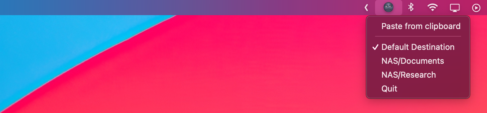

# Synology DL – macOS Menubar App

Menu bar utility app (macOS) for controlling synology download station.



## DSM Compatibility

- For `DSM 6` use `v0.3.x`
- For `DSM 7` use `v0.4.x`

## Config and customization

```conf
# Example config file, by default it should be located at:
# ~/.config/synology_dl.conf

username     = admin
host         = http://nas.local:5000
password     = password
destinations = NAS/folder_1,NAS/folder_2
```

See `Makefile` for how to install, debug, build, and release. Or download the [latest release](https://github.com/visini/synology_dl/releases).
